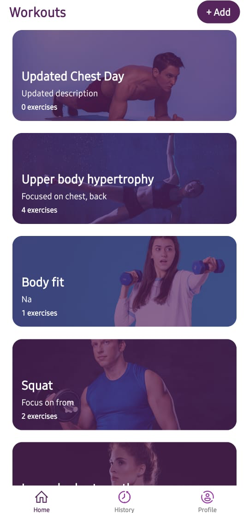
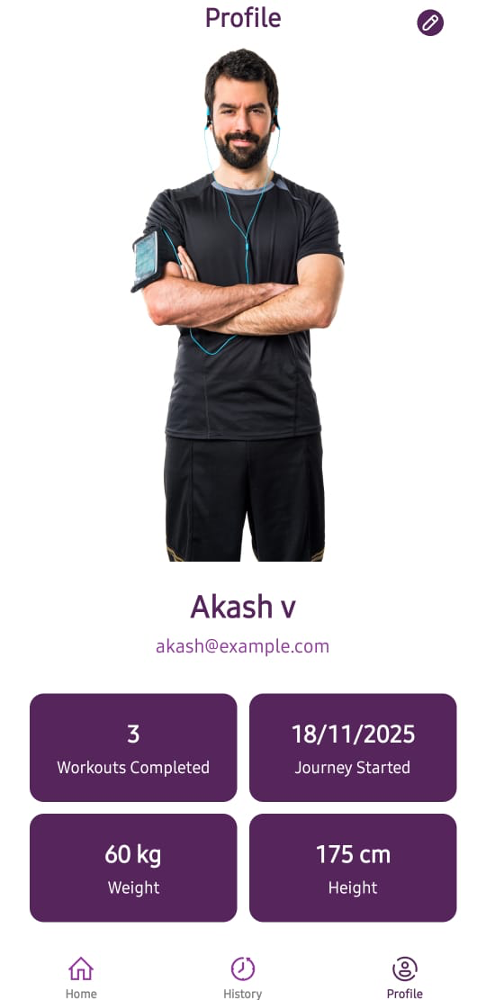

# NXG FitTrack

NXG FitTrack is a **native mobile app** (iOS & Android) built with **React Native**, designed to help users track their workouts, exercises, and fitness progress. The app allows users to browse workout templates, log sets/reps/weights, view workout history, and track progress metrics. A backend API is provided to persist user data and compute metrics.

---

## **Features**

### **Authentication**
- Sign up / login with email and password.
- Auth securely stored using OS secure storage (Keychain / Keystore / AsyncStorage).

### **User Profile**
- View and edit profile: name, weight (kg), height (cm).

### **Workouts & Exercises**
- See workout templates with exercises, sets, and reps.
- Start workouts from templates.
- Add fineshed workouts.
- Add exercises to a template, update or delete templates.

### **History & Metrics**
- View list of past sessions with dates and summaries.
- Metrics:
  - Total training volume (weight × reps) over time (line chart).
  - Personal best per exercise (list or bar chart).
- Filter workout history.

### **Tech Stack**
- Mobile App: React Native, React Navigation, React Native Charts
- State Management: Zustand
- Storage: AsyncStorage
- API Communication: Axios with Bearer token authentication
- Backend API: FastAPI)
- Database: PostgreSQL (for user data, workouts, history)

### **AsyncStorage**
- Used to persist user profile, credentials, and session data locally on the device.
- Provides persistent key-value storage.
- Example usage: store access token and cached profile for offline use.

### **Zustand**
- A lightweight state management library for React.
- Used to manage global app state such as user profile, credentials, and history count.
- Works well with AsyncStorage for keeping the UI in sync with persisted data.

### **API Notes**
- Authorization: Every request to the backend requires a Bearer token (access_token) in the headers.
- Example:
```
GET /workouts/templates
Authorization: Bearer <access_token>
```
---

## **Screenshots / Demo**

<!-- Add screenshots or GIF here -->





---
## Backend API

The backend for NXG FitTrack is hosted in a separate repository:

[GitHub - NXGFitTrack API](https://github.com/AkashV-MLEngr/NXGFitTrack-API)

This repository contains:

- FastAPI backend with user authentication, workouts, history, and metrics.
- Database migrations and seed data.
- Instructions to run locally or via Docker.

---

## **Installation & Setup**

### **Prerequisites**
- Node.js (v18+ recommended)
- npm / yarn
- React Native CLI
- Android Studio / Xcode (for simulators/emulators)
- Backend API running (FastAPI)

### **Clone the repository**
```bash
git clone https://github.com/AkashV-MLEngr/NXGFitTrack-App.git
cd NXGFitTrack
```
### **Install dependencies**
```npm install
```
### **Run on Android**
```
npx react-native run-android
```
### **Run on IOS**
```
npx react-native run-ios
```